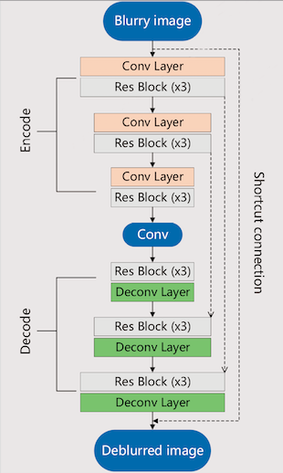

# Simple DeblurNet

## Description

This our modification on [Scale-Recurrent Net for Deblurring](https://github.com/jiangsutx/SRN-Deblur). We name it Simple DeblurNet. The following modifications are made on SRN:

* Substitute the conv-LSTM block with a normal conv layer of the same size.

* Abandon the multi-scale recurrent training process in original SRN.

* Add an overall skip connection: directly add the initial input to the output of the last layer, as what it does in DeblurGAN.
* Devise a new Loss function to fit our compact model and training.

The following figure shows the our model's architecture:



A brief visual comparison among different neural deblurring models:


### Some metrics:

1. GoPro dataset:

| PSNR  | WSNR  | SSIM | MSSSIM | IFC  | NQM   | UIQI | VIF  | BLIINDS2| BRISQUE | CORNIA | DIIVINE| NIQE  | SSE   |  
| ----- | ----- | ---- | ------ | ---- | ----- | ---- | ---- | ------  | --------| -------| ------ | ------| ----- | 
| 23.30 | 23.55 | 0.86 | 0.93   | 2.59 | 19.84 | 0.70 | 0.79 | 39.73   | 114.74  | 122.84 | 43.28  | 20.08 | 44.96 |
2. Lai et al's:

| metrics | real    | uniform | non-uniform |
| ------- | ----    | ------- | ----------- |
|PSNR     |-        |14.17    |14.29        |
|SSIM     |-        |0.39     |0.43         |
|IFC      |-        |0.18     |0.34         |
|NQM      |-        |4.19     |5.58         |
|UIQI     |-        |0.10     |0.17         |
|VIF      |-        |0.10     |0.22         |
|BLIINDS2 |37.12    |45.40    |36.30        |
|BRISQUE  |116.15   |115.39   |110.46       |
|CORNIA   |123.82   |123.97   |122.78       |
|DIIVINE  |41.52    |44.64    |40.49        |
|NIQE     |20.13    |19.71    |19.18        |
|SSEQ     |43.54    |43.61    |34.55        |


## Codes：

This implementation is based on Pytorch0.4 with Cuda backend (CPU version is not considered.)

For visulization, we use a third-party package [TensorBoardX](https://github.com/lanpa/tensorboardX).

For other package losing, you can easily fix by code debugging.

## How to Run:

### To Train:

For training the model, you need to specify the training dataset. Here we use [GoPro dataset](https://drive.google.com/file/d/1H0PIXvJH4c40pk7ou6nAwoxuR4Qh_Sa2/view?usp=sharing). Unzip this dataset and set the `dataset_dir` attribute in `train_config.py` to the root directory of the dataset.

You can also set other attributes in `train_config.py`  

To run the code, simply type:

```bash
python train.py
```

### To Test:

You must first specify the directory where model checkpoint file is saved, e.g. checkpoint is saved in `./`. Our testing code only suports for GoPro testing set. For other purpose, you need manually modify the code.

To run the code, type:

```bash
python test.py ./
```

